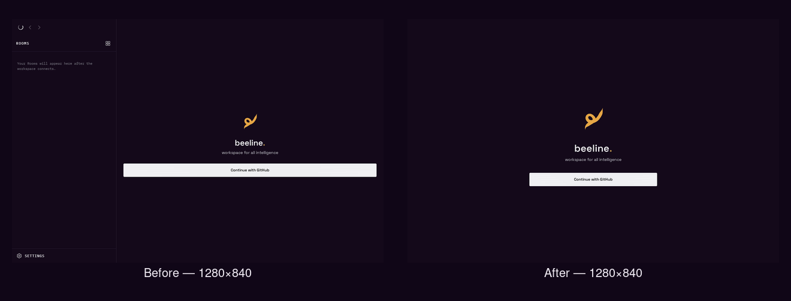
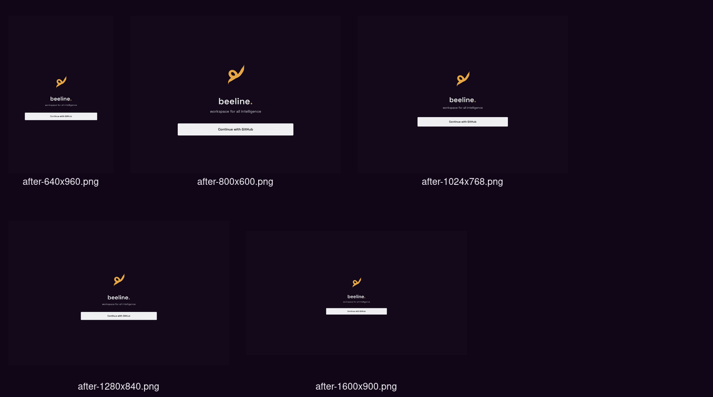
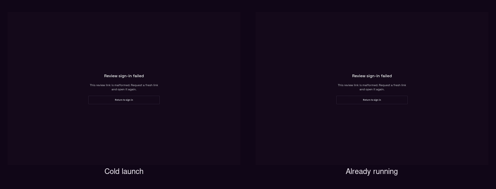

# Packaged Linux desktop product pass

Validated 2026-09-09 against the packaged preview AppImage, not a browser preview.

## Result

- Signed-out desktop launches now show only the intentional authentication surface. Authenticated Rooms, workspace controls, Settings, Sign out, and Delete account are absent until a session exists.
- The Beeline mark scales to 156px and the GitHub action is capped at 440px on desktop. The shared mobile dimensions remain unchanged.
- Native desktop retains its desktop shell policy below 640px; the breakpoint no longer swaps the whole application to the phone frame.
- `beeline://` delivery is centralized at the desktop boundary. Cold and second-instance review links route before the identity redirect, the existing window is raised, and malformed/refused review links render an actionable error.
- Native focus-visible styling covers the keyboard stops, disabled history buttons leave the tab order, and Tab cycles over the visible stop list. Context menus are suppressed unless a surface explicitly opts into native context actions.

## Native evidence







Individual captures are in [`screenshots/`](./screenshots/). The final artifact was exercised at exactly 640×960, 800×600, 1024×768, 1280×840, and 1600×900 with native window resizing. At 1280×840:

- left-clicking **Return to sign in** returned from the review error to the signed-out surface;
- the first and second Tab captures were pixel-identical (`AE=0`), proving the only signed-out stop remains visibly focused when focus wraps;
- the focused capture differs from the unfocused baseline (`AE=1992` pixels);
- the right-click capture is pixel-identical to the clean baseline (`AE=0`), proving no blank black menu appeared.

Cold launch and running-app handoff were exercised by passing `beeline://review/short` to the AppImage. Both visibly rendered **Review sign-in failed** with guidance to request a fresh link and a **Return to sign in** action. A real review secret was not stored in this worktree; behavioral route coverage separately verifies that an accepted exchange lands in Rooms and a server rejection stays actionable.

## Artifact and checks

Final AppImage:

```text
apps/mobile/src-tauri/target/release/bundle/appimage/Beeline Preview_0.2.18_amd64.AppImage
size: 84,920,824 bytes
sha256: 08fc42f6656971d10fc6d9107d3d4a78f38380e7339239e4eabbb4b30dc4ce7d
```

- `npm run tauri:build:preview --prefix apps/mobile` — passed; produced AppImage, deb, and rpm bundles.
- `cargo fmt --check --manifest-path apps/mobile/src-tauri/Cargo.toml` — passed.
- `cargo check --manifest-path apps/mobile/src-tauri/Cargo.toml` — passed.
- Desktop configuration JSON for the shared base plus preview/dev overlays parsed successfully. Linux-only registration remains cfg-gated, so the macOS and Windows shell configuration/code paths are untouched and compile-visible.
- Focused mobile/shared-surface suite — 10 files, 49 tests passed. It covers cold routing, running delivery, accepted/rejected/malformed review sign-in, session gating, desktop breakpoint policy, onboarding brand behavior, sign-out/delete session clearing, and shared layout/session behavior.
- `npm run typecheck --prefix apps/mobile` — one pre-existing error remains at `sources/app/(app)/beeline/settings/identity.tsx:230`: a GitHub `ManagedIdentity` fallback lacks `nip05`. That file is byte-for-byte unchanged from `origin/main`; this pass introduces no typecheck diagnostic.

## Evidence inventory

- `before-1280x840.png`: audit baseline showing signed-out Rooms/settings chrome and monitor-wide CTA.
- `after-{640x960,800x600,1024x768,1280x840,1600x900}.png`: final signed-out size matrix.
- `after-cold-review-error.png`, `after-running-review-error.png`: native deep-link outcomes.
- `after-mouse-return-sign-in.png`: mouse return action result.
- `after-focus-first.png`, `after-focus-second.png`: keyboard focus and wrap.
- `after-right-click.png`: suppressed no-action context menu.
