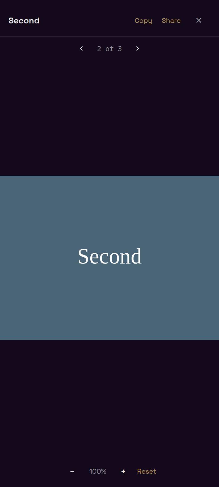
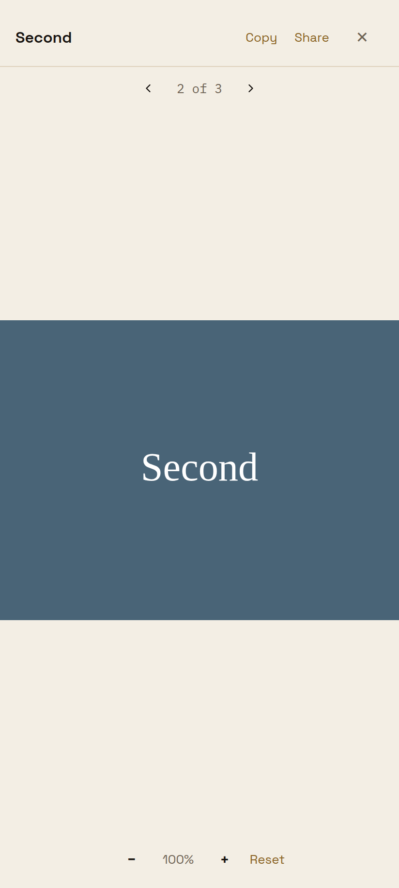

# Full-screen message photo navigation

Reproduction PHOTO-SWIPE-1, captured on 2026-10-04 from reviewed product head `849f005902b226a50be8bb7cb3db34dcb7cf91c3`.

A person who opens the third picture of a grouped message and swipes right sees the second picture in the full-screen viewer with the Previous / 2 of 3 / Next row.

| Obsidian | Bone |
| --- | --- |
|  |  |

These are Chrome captures at a 412 × 915 CSS-pixel phone viewport, with the repository fonts and theme tokens. The isolated harness renders the real ArtifactCard, ArtifactViewerScreen, ArtifactImage and ZoomableArtifactImage through React Native Web. Each capture selects Third in the card, opens the viewer, sends a rightward touch swipe, and asserts Second, 2 of 3, both navigation controls and fitted zoom before capture.

The harness supplies local synthetic images and records picture action targets. It does not verify authenticated media loading, native clipboard or share sheets. The prior Android attempt remained on Loading Rooms. The screenshot fixture is not a production message or a redesign reference.

This evidence-only revision adds screenshots and documentation; product code is unchanged from the reviewed head.
