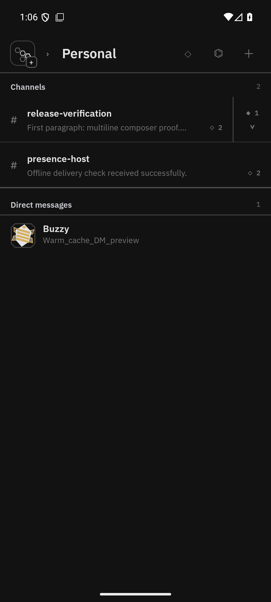
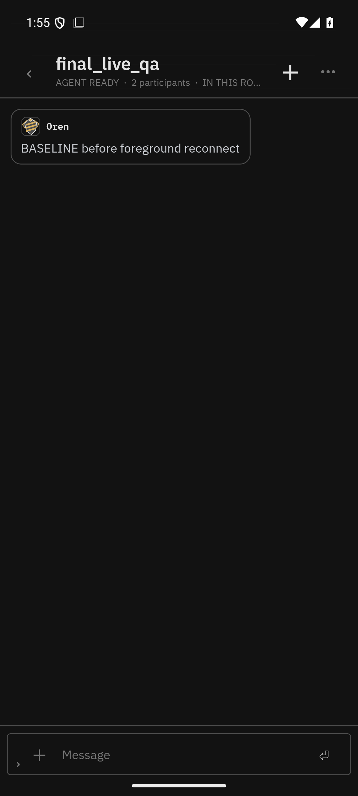
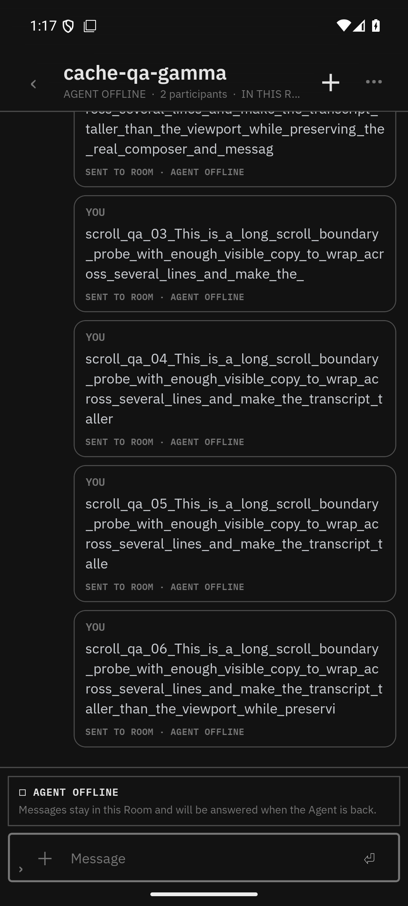

# Chat cache and foreground reconnect verification (API 36)

Verified on `emulator-5554` with a throwaway identity and Workspace containing four Rooms and one DM. The release APK was built with Gradle `--max-workers=2` and installed without changing `versionCode` (22).

## Warm Room-list navigation

- Back navigation started at `1786727170028` ms.
- The cached list was visible when the tap returned at `1786727170133` ms: **105 ms**.
- No loading overlay was shown on the warm path. Relay enrichment continued without erasing cached message previews.

## Foreground subscriptions and presence

- The test agent published `LIVE_RECONNECT_VERIFIED` after the foreground reconnect.
- Publish completed at `1786730321537` ms; the screenshot containing the message completed at `1786730323297` ms: **1.76 s** including `adb screencap` transfer.
- A resumed heartbeat changed the visible agent state back to ready without re-navigation.
- The foreground-grace unit proof covers the boundary case where the last online heartbeat crosses the 120-second lease while the app is backgrounded; explicit offline signals are never masked.

## Transcript scroll boundary

After four aggressive upward swipes at the bottom of a six-message multiline transcript, the last bubble settled only 31 px from its prior bottom position. The list could not be dragged into the former keyboard-height-sized empty tail.

## Automated gates

- Mobile: 122 files, 1,062 tests passed.
- Repository typecheck: 10/10 Turbo tasks plus isolated mobile TypeScript passed.
- Fresh clone: `npm ci` at root and mobile, uncached repository typecheck passed, then all 1,062 mobile tests passed.
