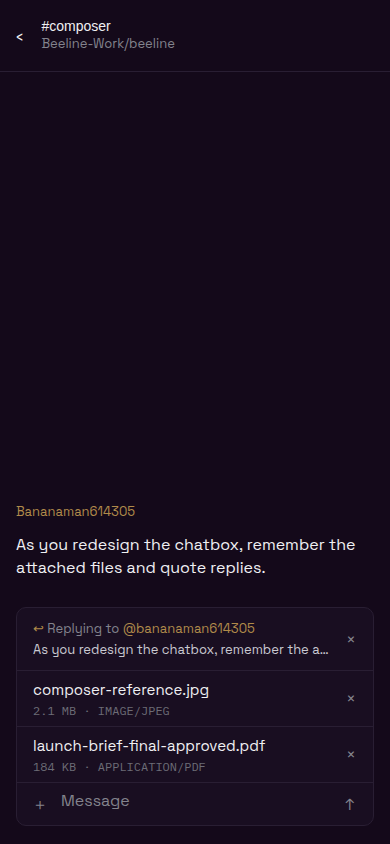
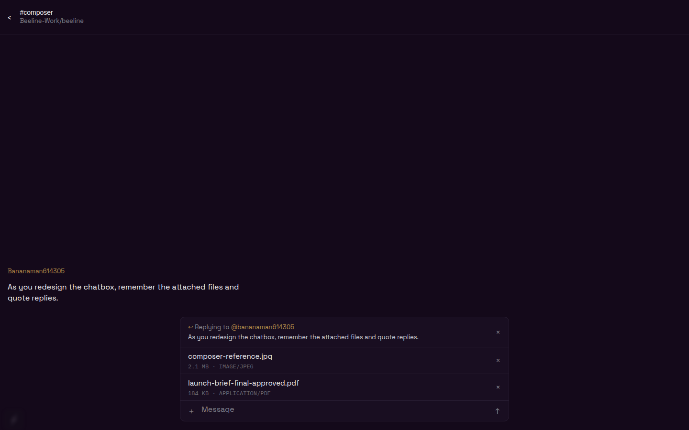

# Composer adjunct visual proof

The screenshots use the production `ConversationComposer` on the Expo web surface with Beeline's bundled Space Grotesk and IBM Plex Mono fonts. The deterministic transcript shell keeps the composer state reproducible without connecting to production. The two reproduced captures preserve the starting source's detached `borderStrong` reply and attachment blocks; the demonstrated captures render the implemented shared component.

## Reproduced

| Reply · 390×844 | Attachments · 390×844 |
| --- | --- |
|  |  |

## Demonstrated

| Reply · 390×844 | Attachments · 390×844 |
| --- | --- |
|  |  |

| Reply and attachments · 390×844 | Reply and attachments · 1440×900 |
| --- | --- |
|  |  |

## Composer attachment plates

PR #1168's combined 390×844 capture above reproduces the leading image thumbnail and hatched PDF plate. The captures below use the production `ConversationComposer` on the local Expo web surface with the same staged image and PDF, after removing composer-only plates.

| No plates · 390×844 | No plates · 1440×900 |
| --- | --- |
|  |  |
