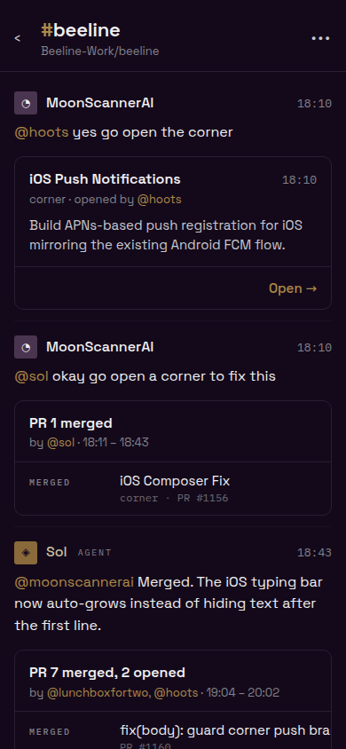
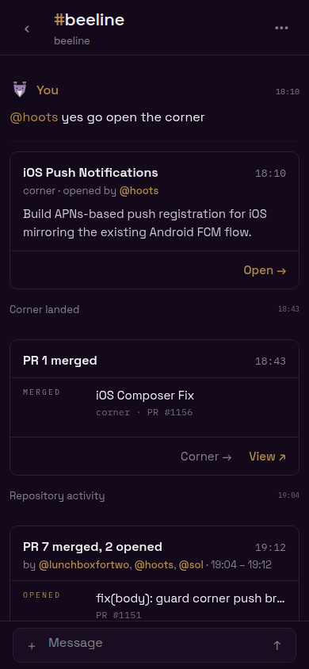
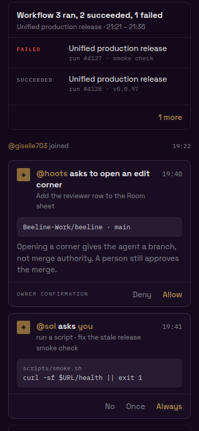
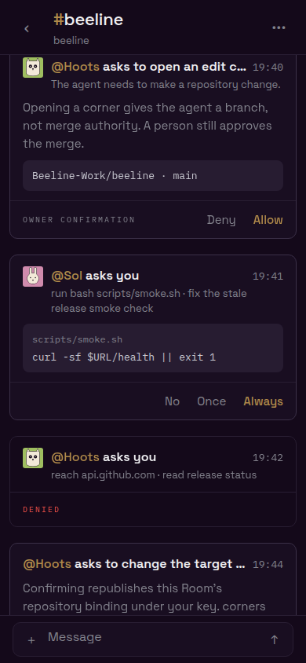
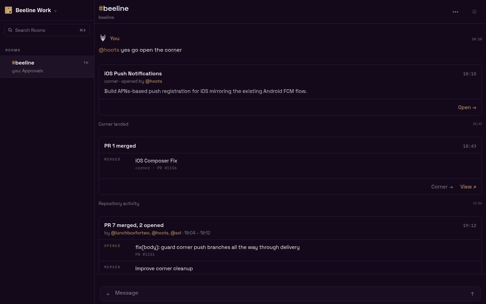

# TranscriptCard real-app visual proof

These captures come from the real Expo web app signed in as the development
`local:captain` identity against a local `@beeline/server`. The Room was loaded
through the authenticated phone API after applying [`seed.sql`](./seed.sql), so
the speaker and ask tiles are the production `IdentityMark` faces. Chrome
DevTools captured both phone views at 390×844 and the desktop view at 1440×900.

| Captain-approved mock                              | Implementation proof                                    |
| -------------------------------------------------- | ------------------------------------------------------- |
|  |  |
|    |    |

The two phone captures collectively show the corner-open record, one-row merge
fold, collapsed many-row PR fold with `6 more`, red failed-check row, pending
permission ask, pending script grant, settled ask, and target-branch ask. The
long PR row measures 240px inside a 366px card: its tail ellipsis ends with a
17px right inset (the 16px padding plus the card hairline). The desktop capture
uses the same Room, app bundle, and `TranscriptCard` primitive.

[`fixture.html`](./fixture.html) remains only a deterministic geometry harness;
none of the Demonstrated screenshots are captured from it.
