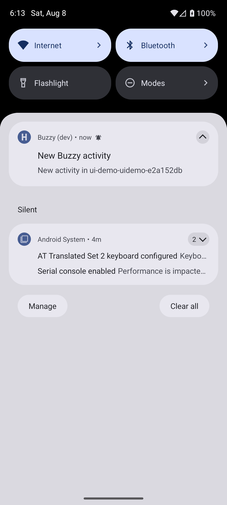

# Android push live proof

Verified on 2026-08-08 with AVD `buzzy_api36` (Android API 36) and the live Buzz relay at `127.0.0.1:3010`.

## Public gateway route

The gateway used its default bind `127.0.0.1:8788`. The public Cloudflare route reached the running process:

```text
GET https://push.buzzrouter.com/health
{"ok":true,"registeredPubkeys":0,"registeredDevices":0}

POST https://push.buzzrouter.com/registrations (intentionally invalid body)
HTTP 400
{"error":"only android registrations are supported"}
```

The release APK used the default registration URL `https://push.buzzrouter.com`. After importing the provisioned identity, the gateway logged only a truncated pubkey and count:

```text
[push] device registered pubkey=bdd178af1c63… devices=1
```

## Relay event to FCM

The host posted this distinct marker from a second member of the provisioned channel:

```text
marker=FCM-LIVE-API36-20260808-1813
channel=429b2451-808a-496d-a343-325c96750025
event=533f1cbf52ddd518fd643cabb649a07b9331fe838a1320e2b3f4ad978c72776c
```

The gateway observed the ACL-scoped relay event and Firebase accepted the device delivery:

```text
[push] FCM sent event=533f1cbf52dd channel=429b2451-808a-496d-a343-325c96750025 recipients=1 success=1 failure=0
```



## Privacy

Notification content is deliberately generic. Message plaintext is never copied from the relay event into the Firebase payload. If the relay exposes only E2E ciphertext to the gateway, the gateway still sends only `New activity in <channel>` and does not attempt to decrypt it.
