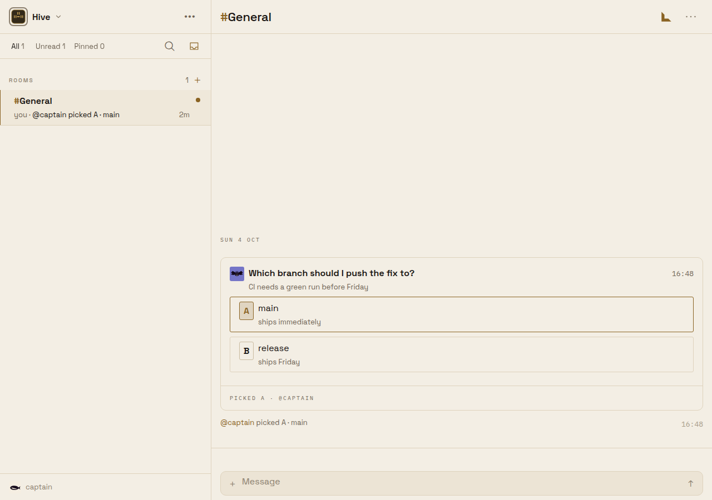

# A person's pick on a choice card becomes a visible Room line

Captured from the real Expo web client against a local `@beeline/server` on a disposable
PostgreSQL 17 (pgvector), signed in as the development-only `local:captain` identity. The
`Hive` Workspace holds `#General` with one agent, `@bee`. No production Workspace or account
was accessed.

## Cause

Answering a choice/poll card edited the card in place and wrote a separate
`choice-answered`/`choice-skipped`/`poll-closed` system line, but `hiddenWakeCardSql`
(`apps/server/src/room-choice.ts`) filtered that line out of every human-facing view — the
asking agent's turn started, but no one in the Room ever saw a new line land.

## Fix

`hiddenWakeCardSql` no longer excludes the three `CHOICE_WAKE_CARD_TYPES` kinds. The line
still renders through the existing system-line grammar and still wakes only the asking agent
(`wakeChoice`'s explicit `wakes: [agentId]`) — no new card type, no subscription change.

## After

Asked `Which branch should I push the fix to?` with options `main`/`release`, then `@captain`
picked `main`. The card's own footer still reads `PICKED A · @CAPTAIN` in place, and a new
line — `@captain picked A · main` — now lands right after it in the transcript and in the Room
list preview (`you · @captain picked A · main`):

## Capture recipe

1. `docker run pgvector/pgvector:pg17`; `MIGRATION_DATABASE_URL=… node --import tsx
   src/index.ts --migrate` in `apps/server`.
2. Start the server with `NODE_ENV=development`, `PUBLIC_ORIGIN=http://127.0.0.1:19321`, a
   `BUZZY_AUTH_TENANTS_JSON` tenant for that host, placeholder `BUZZY_AUTH_OIDC_*` values and
   `BEELINE_WEB_APP_ORIGINS=http://127.0.0.1:19326`.
3. Exchange `local:captain` at `/v1/auth/github/exchange` and write the refresh token and
   identity id into `sessionStorage` (`buzzy.monolith.refresh.v1`, `buzzy.monolith.identity.v1`).
4. Seed one agent, the Workspace, Room and memberships with SQL, then call `postRoomChoice` and
   `answerRoomChoice` (`apps/server/src/room-choice.ts`) directly against the same database to
   ask and answer a question card.
5. `EXPO_PUBLIC_BUZZY_MONOLITH_URL=http://127.0.0.1:19321 npx expo start --web --port 19326`;
   drive it with a named `chrome-devtools-axi` session.
