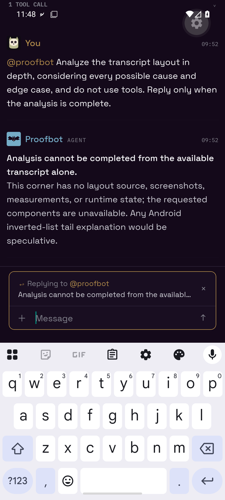

# Android corner reply evidence

Pre-fix reproduction used the Android emulator against production app v0.2.18 in the active
`#proof/Gap Proof` corner:

- Agent final message: swiping opened the ordinary reply composer with the agent and parent quote.
  Sending could not be confirmed because the production development build reloaded immediately
  after the send tap.
- Agent narration row: no reply affordance.
- Tool-call activity row: no reply affordance; the only gesture disclosed the tool-call details.

The defect was therefore the activity-row path, not the ordinary final-message row. The fix gives
the whole narration/tool activity group the same reply swipe and composer quote. Its quoted excerpt
stays in the sent text. The reply uses the same turn's final agent message as its parent when one
exists, otherwise the latest real message from that agent in the corner. With no real parent yet, it
is sent as an addressed steer.

