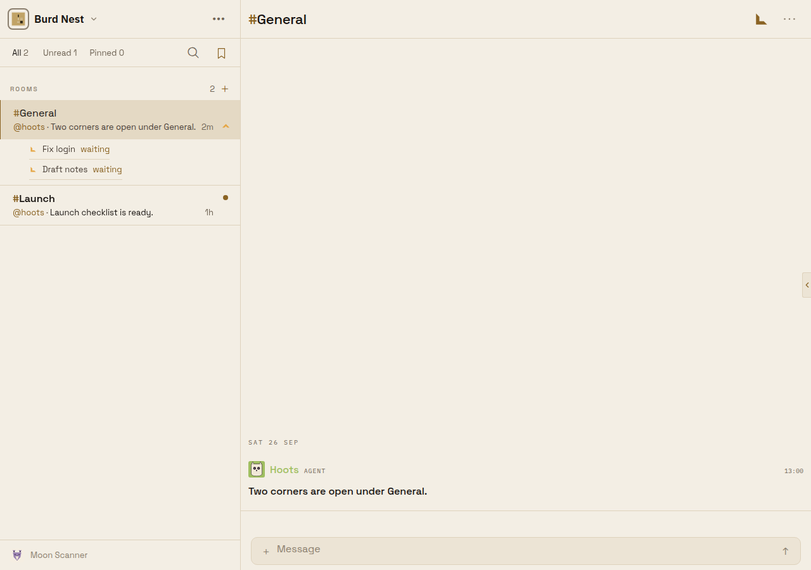
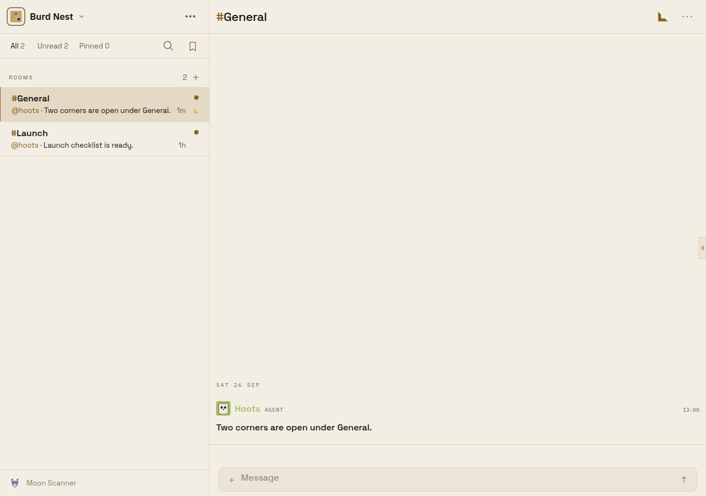
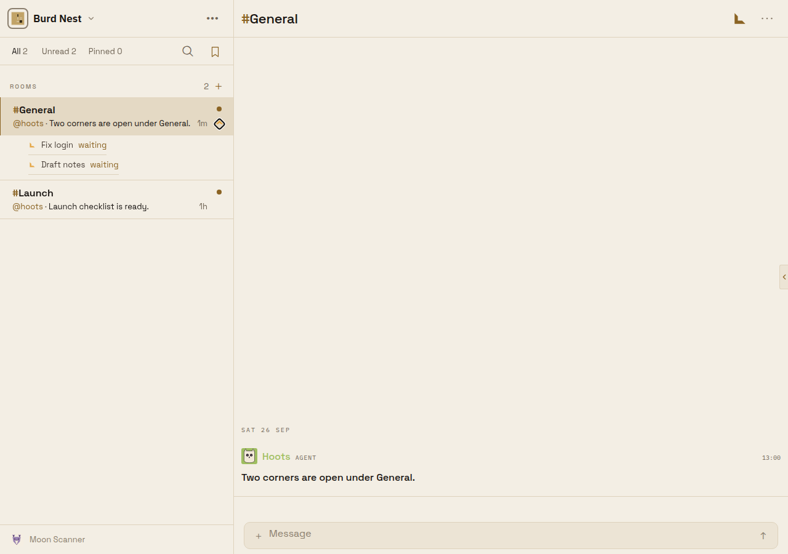
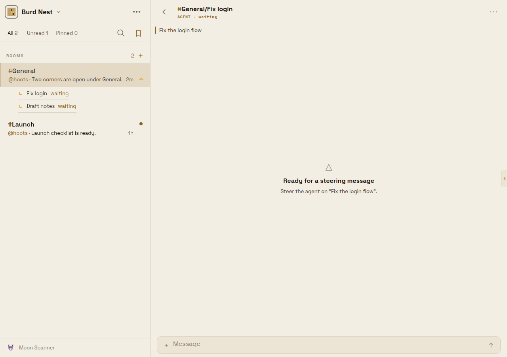

# A desktop Room click leaves its corner list collapsed

Captured from the Expo web build at 1280×900 against a disposable local `@beeline/server` +
PostgreSQL, signed in as the development-only `local:captain` identity. The `Burd Nest`
Workspace holds `#General` with two open corners the viewer commissioned, and `#Launch` with
none. No production Workspace or account was accessed.

## Cause

#1730 put each Room's corners behind the row's corner glyph, and in the same change added an
effect in `apps/mobile/sources/components/SidebarView.tsx` that expanded whichever Room was
active. A row click makes that Room active, so every click on a Room with corners also opened
its corner list.

## Before (base `1ac401d16`)

Clicking the `#General` row opened the Room and expanded its corners.

## After

| Row click: Room opens, corners stay collapsed | Glyph click: corners expand |
| --- | --- |
|  |  |

Opening a corner itself as the main-pane route (`/beeline/chat/<corner>?parent=<room>`, e.g.
from a notification) still expands its parent Room so the open corner is visible beneath it:

## Capture recipe

1. Start a disposable PostgreSQL 17 container and run `node dist/index.js --migrate` with
   `DATABASE_URL` and `MIGRATION_DATABASE_URL` pointed at it.
2. Start `@beeline/server` with `NODE_ENV=development`, an HTTP `PUBLIC_ORIGIN`, a matching
   `BUZZY_AUTH_TENANTS_JSON`, the five OIDC development placeholders, and the Expo origin in
   `BEELINE_WEB_APP_ORIGINS`.
3. Exchange `local:captain` at `/v1/auth/github/exchange` (`{"oidcToken":"local:captain"}`)
   and write the refresh token and identity id to `sessionStorage` under
   `buzzy.monolith.refresh.v1` and `buzzy.monolith.identity.v1`.
4. Seed the Workspace, two Rooms, and two `corner_facts` rows with `commissioned_by` set to the
   viewer, then start Expo web with `EXPO_PUBLIC_BUZZY_MONOLITH_URL` pointed at the server.
5. For the before frame, restart Expo with the base `SidebarView.tsx`; for the after frames,
   with this branch.
