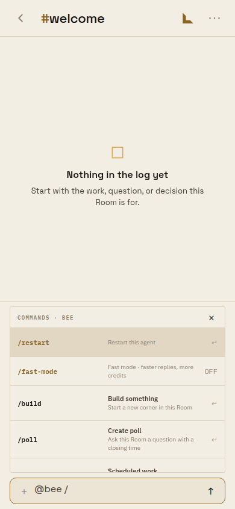
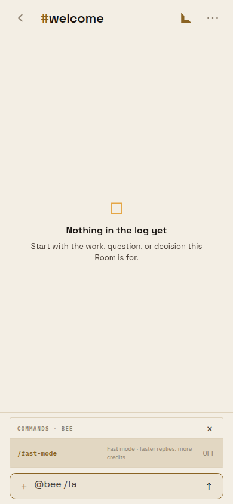
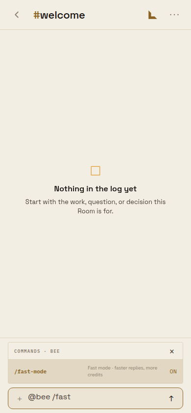
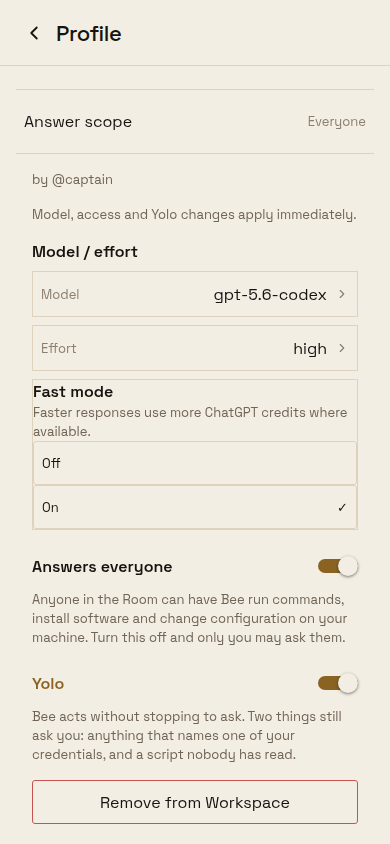
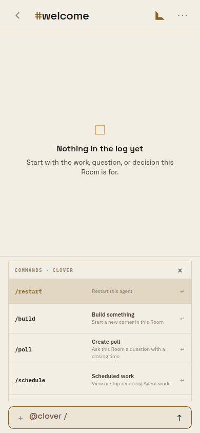
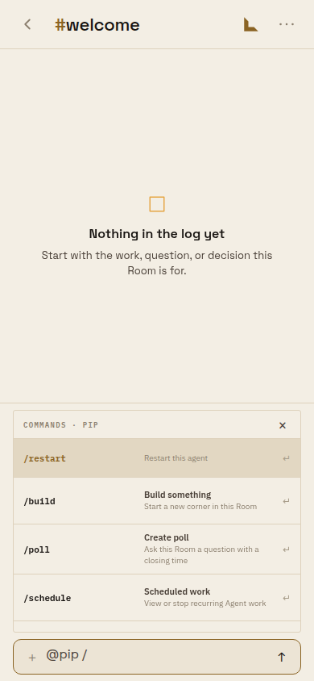
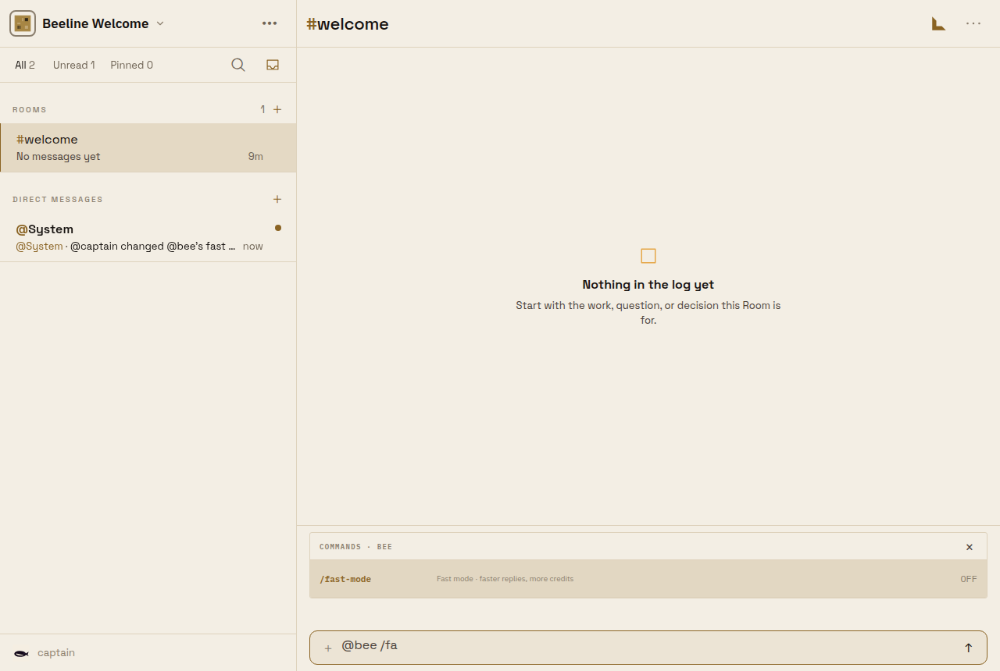
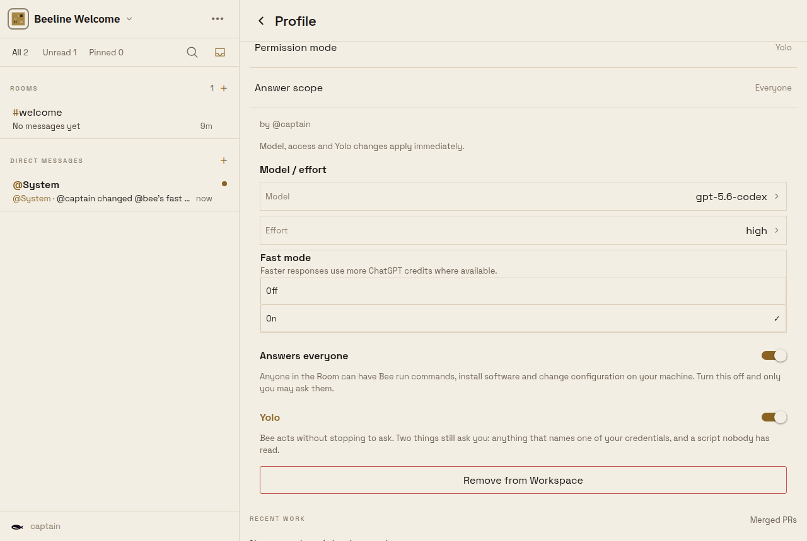

# Fast mode in the agent command picker

Frames from the Expo web client against a local `@beeline/server` on a disposable
PostgreSQL 16, signed in as the development-only `local:captain`. Seeded agents in
`#welcome`: `@bee` (Codex catalog with the `fast-mode` axis, owned by the captain),
`@clover` (Claude catalog, no Fast mode, owned by the captain) and `@pip` (Codex
catalog with Fast mode, owned by `local:juniper`).

## Phone (390 × 844)

| `@bee /`                             | `@bee /fa`                      | Enter on the row                 |
| ------------------------------------ | ------------------------------- | -------------------------------- |
|  |  |  |

The row is `/fast-mode` with its state in the trailing column. Typing `fa` narrows
the list to it (Beeline's Room verbs now follow the same typed query). Enter toggles
it through `updateAgentModelSelection`; the database row read `fast_mode = t` and
one `@captain changed @bee's fast mode to on` fact landed in each member's `@system` DM.

| Profile shows On                         | Profile set Off                                | Picker follows                                 |
| ---------------------------------------- | ---------------------------------------------- | ---------------------------------------------- |
|  |  |  |

| Unsupported agent (`@clover`)               | Someone else's agent (`@pip`)    |
| ------------------------------------------- | -------------------------------- |
|  |  |

## Desktop (1280 × 860)

| `@bee /fa`                        | Clicked                            | Profile                                 |
| --------------------------------- | ---------------------------------- | --------------------------------------- |
|  |  |  |

## Capture recipe

1. `docker run postgres:16`; `node --import tsx src/index.ts --migrate` in `apps/server`.
2. Start the server with `NODE_ENV=development`, `PUBLIC_ORIGIN`, a `BUZZY_AUTH_TENANTS_JSON`
   tenant for that host, placeholder `https` `BUZZY_AUTH_OIDC_*` values and
   `BEELINE_WEB_APP_ORIGINS` naming the Expo origin.
3. Exchange `local:captain` and `local:juniper` at `/v1/auth/github/exchange`; seed the three
   agents' `identities`, `memberships` and `agents.model_catalog` rows with SQL.
4. `EXPO_PUBLIC_BUZZY_MONOLITH_URL=<server> npx expo start --web`; write the refresh token and
   identity id into `sessionStorage` (`buzzy.monolith.refresh.v1`,
   `buzzy.monolith.identity.v1`) and drive a named `chrome-devtools-axi` session.
