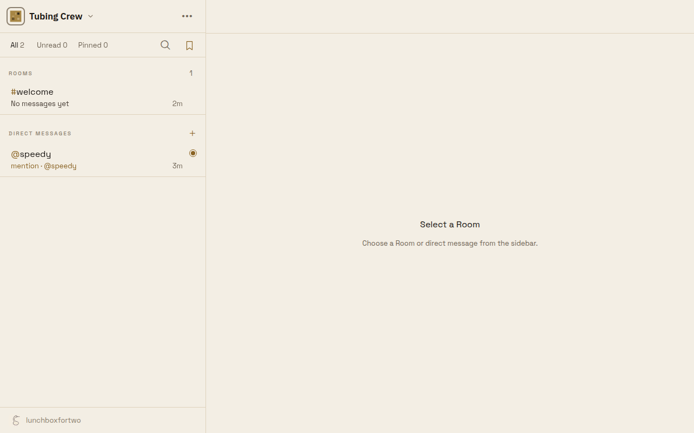
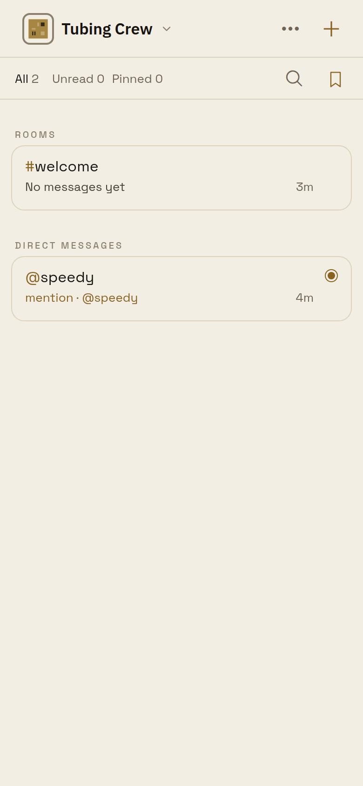
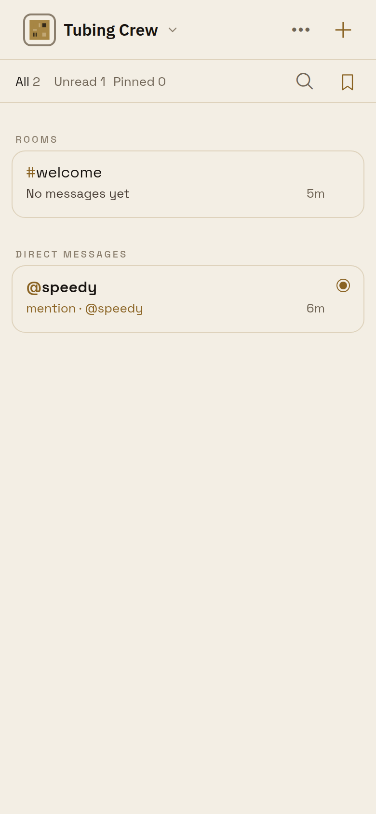
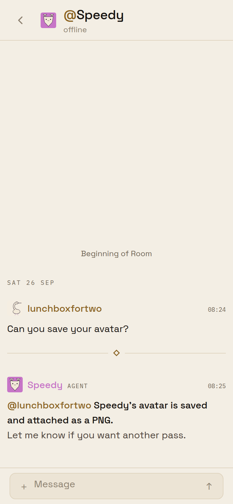
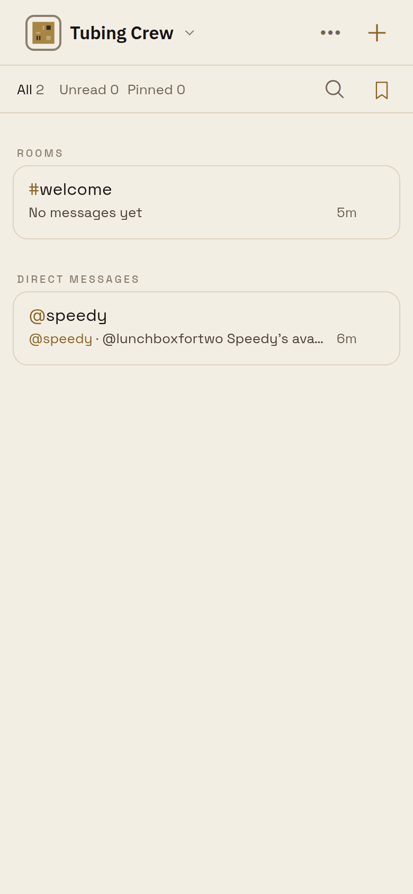
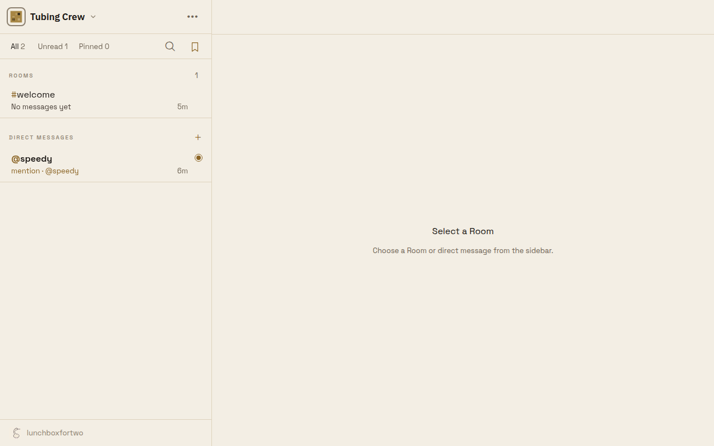
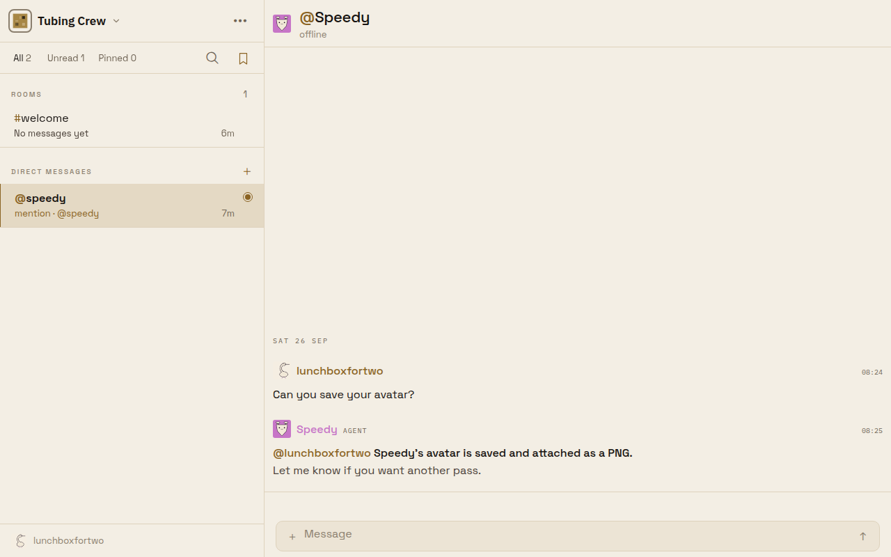
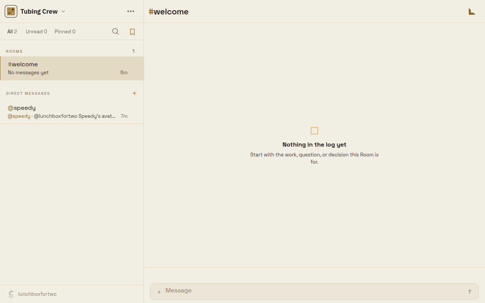
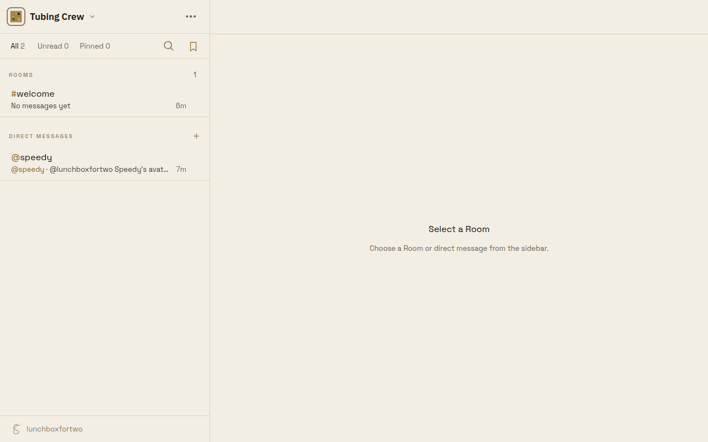

# A read mention clears the needs-you ring

Captured from the Expo web build against a local `@beeline/server` + PostgreSQL. The Workspace
"Tubing Crew" holds an agent `@speedy` whose DM message tags the viewer (`@lunchboxfortwo`). The
DM was read and marked unread through the real `/v1/phone/rooms/:id/read|unread` routes; the chats
API reported `unread` flipping while `latestMessage.mentionsViewer` stayed `true` throughout.

Before the fix the row's ring and `mention · @speedy` line keyed on `mentionsViewer` alone, so a
read mention rang forever:

| Desktop                                                          | Phone                                                          |
| ---------------------------------------------------------------- | -------------------------------------------------------------- |
|  |  |

After the fix (`apps/mobile/sources/buzz/room-list-row.ts`) the mention rings only while unread.

Phone: unread mention rings, opening the DM reads it, the deck row returns plain.

| Unread                                                | Opened                                    | Back on the deck                             |
| ----------------------------------------------------- | ----------------------------------------- | -------------------------------------------- |
|  |  |  |

Desktop: unread mention rings; while the DM stays open the sidebar has not refetched yet (its
Unread counter lags identically — the deck marks on return); leaving the DM or a cold load shows it
plain.

| Unread                                                  | DM open                                                           | Left the DM                                             | Cold load                                              |
| ------------------------------------------------------- | ----------------------------------------------------------------- | ------------------------------------------------------- | ------------------------------------------------------ |
|  |  |  |  |
