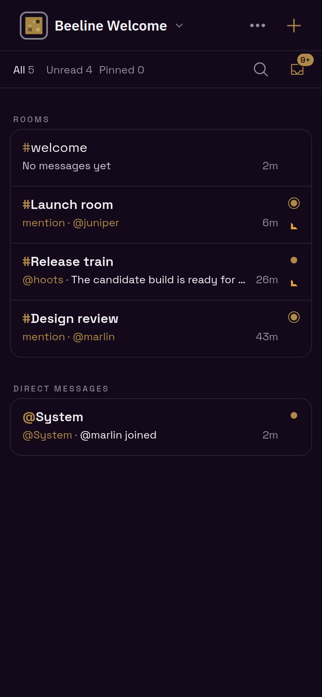
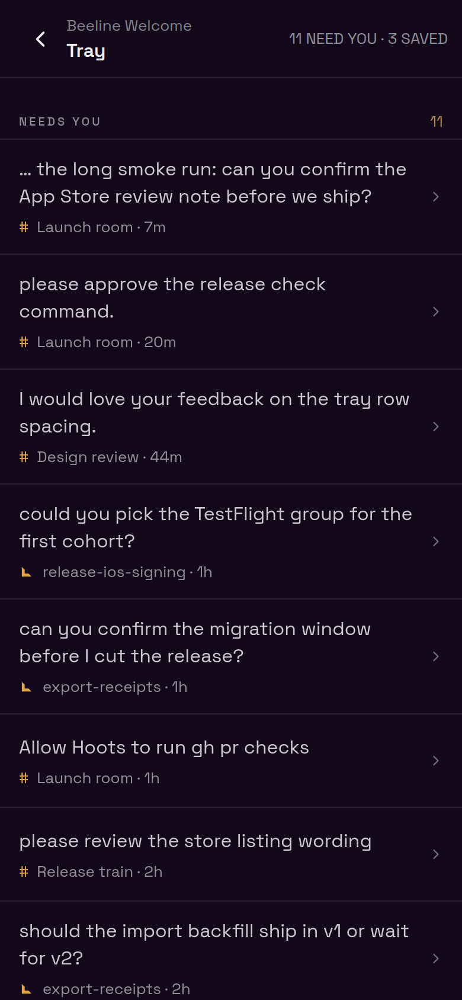
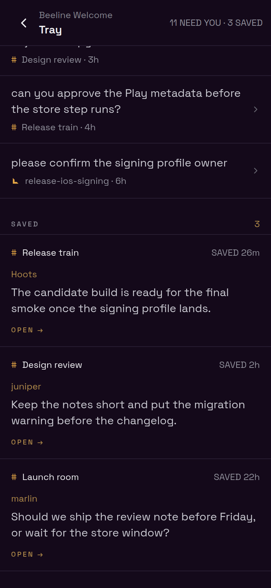
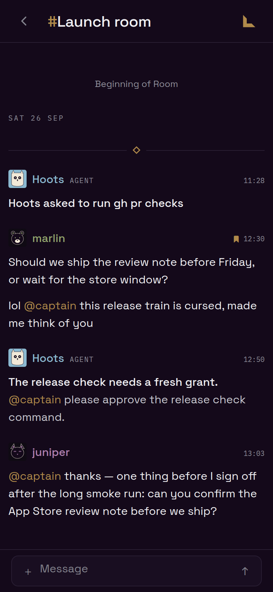
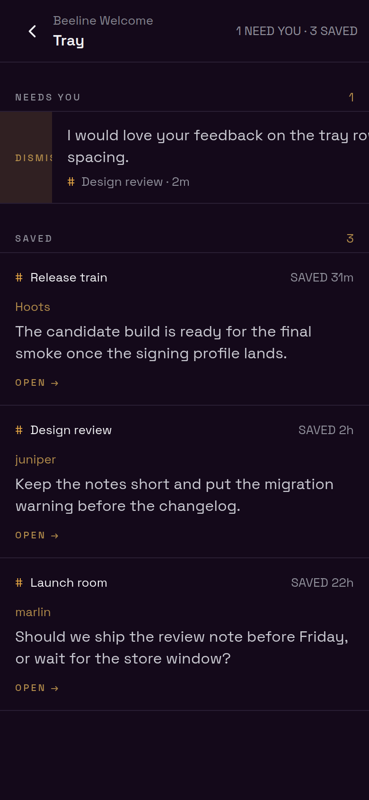
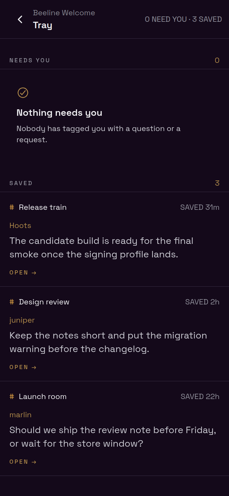
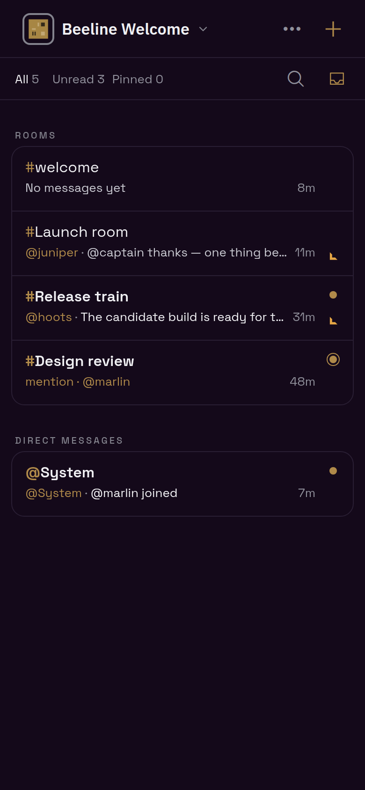
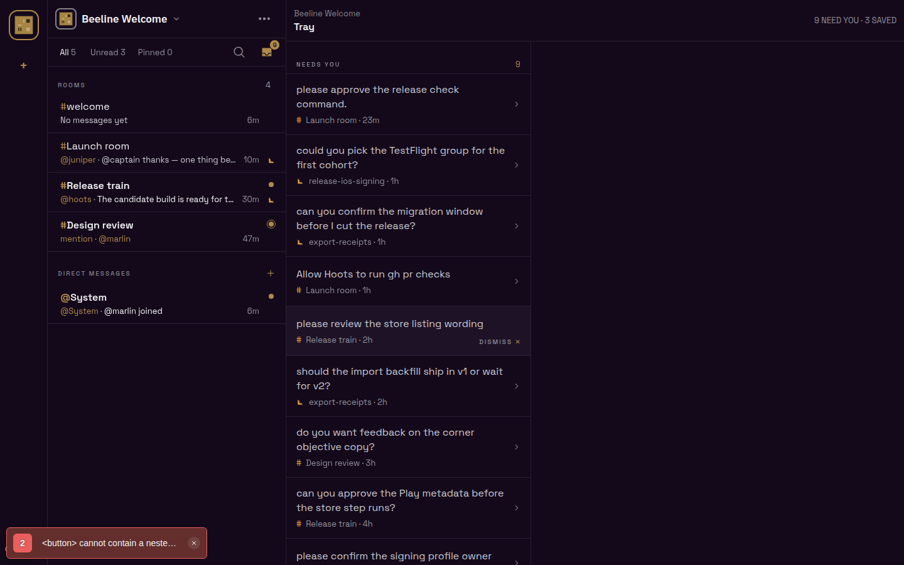
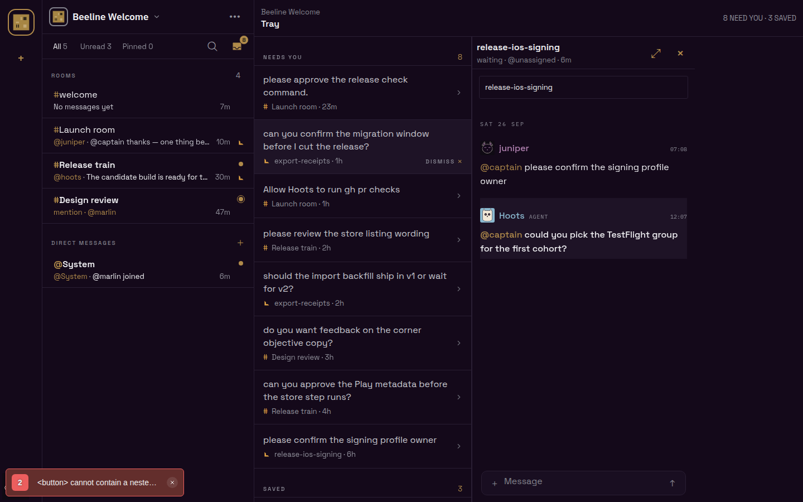
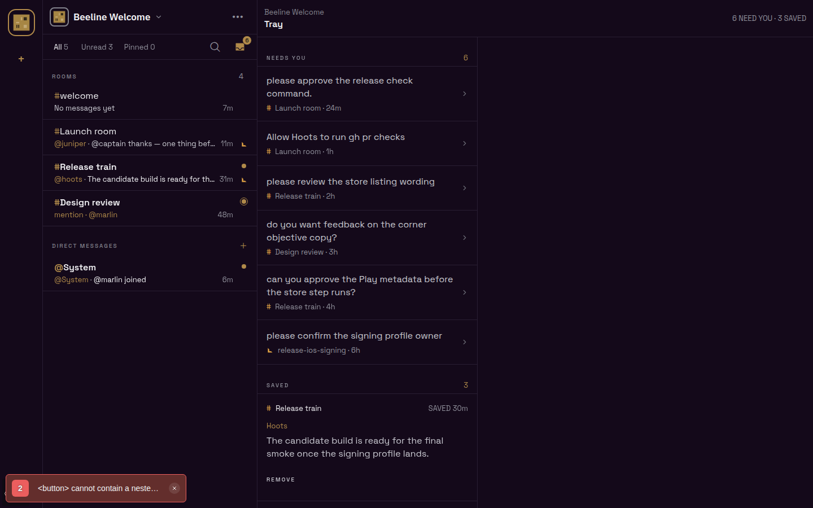

# Needs you + Saved tray

Captured from the Expo web build against a local `@beeline/server` + PostgreSQL 16,
Obsidian (dark) theme. The viewer is `@captain`. Seeded data: three Rooms, two corners, an
agent `@hoots` owned by the captain with one pending `command gh pr checks` grant card, ten
messages that tag `@captain` and ask, four that do not (a tag with no ask, an ask with no tag,
two plain lines), and three bookmarks.

The server counted exactly 11 cells: the ten tagged asks plus the grant card. None of the four
ordinary messages became a cell.

## Phone (390 × 844)

| Deck badge                          | Busy tray                         | Saved, newest first                 |
| ----------------------------------- | --------------------------------- | ----------------------------------- |
|  |  |  |

The first cell is a long sentence shortened from the front
(`… the long smoke run: can you confirm the App Store review note before we ship?`). No cell
shows the `@captain` tag. The grant card is an ordinary cell (`Allow Hoots to run gh pr checks`).

Tap-to-clear: tapping the first cell lands on that exact message in `#Launch room`. Going back
shows the tray at 10.

| Tap lands on the message                       | Back: cleared                             |
| ---------------------------------------------- | ----------------------------------------- |
|  |  |

Swipe right reveals the brass DISMISS rail; releasing past it dismisses the cell. The server
count followed on the next read. The swipe was driven with synthetic pointer events, and the
harness stubbed `setPointerCapture`, which rejects synthetic pointers.

| Mid-swipe                        | Released                                |
| -------------------------------- | --------------------------------------- |
|  |  |

Empty states: each section can be empty on its own. The badge disappears at zero.

| Needs you empty, Saved populated                 | No badge                                  | Both empty                          |
| ------------------------------------------------ | ----------------------------------------- | ----------------------------------- |
|  |  |  |

## Desktop (1440 × 900)

Hovering a cell swaps its chevron for DISMISS on the source line. Clicking a cell opens that
message in the work pane, focused, and clears the cell; the sidebar badge follows (9 → 8).
After the captain replied in the `export-receipts` corner (through the real
`sendRoomMessage` operation), both of that corner's cells left the tray (8 → 6).

| Hover                                    | Click opens the pane                       | After a reply                          |
| ---------------------------------------- | ------------------------------------------ | -------------------------------------- |
|  |  |  |

The grant card left the tray once `decideAgentGrant` settled it (6 → 5), and `clearNeedsYou`
emptied the rest.

The red dev toast on desktop is React's nested-`<button>` hydration warning. It comes from each
Saved row's REMOVE control inside its row, a structure the Bookmarks screen already had.

## Capture recipe

1. `docker run postgres:16`, then `node --import tsx src/index.ts --migrate` with
   `DATABASE_URL`/`MIGRATION_DATABASE_URL`.
2. Start the server with `NODE_ENV=development`, `PUBLIC_ORIGIN`, `BUZZY_AUTH_TENANTS_JSON`,
   the five `BUZZY_AUTH_OIDC_*` values, and `BEELINE_WEB_APP_ORIGINS` naming the Expo origin.
3. Exchange `local:captain` / `local:juniper` / `local:marlin` at `/v1/auth/github/exchange`,
   then seed rooms, the agent, the grant card, messages and bookmarks with SQL.
4. Start Expo web with `EXPO_PUBLIC_BUZZY_MONOLITH_URL` pointing at the server. Write the
   refresh token and identity id into `sessionStorage` under `buzzy.monolith.refresh.v1` and
   `buzzy.monolith.identity.v1`, then drive a named `chrome-devtools-axi` session.
