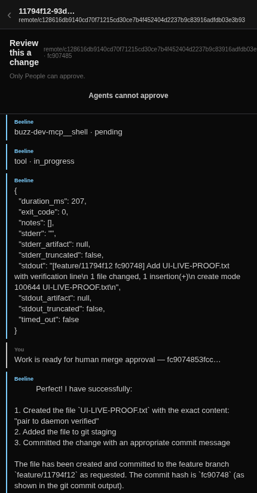

# One-command agent runtime live proof

Verified on the local Buzz relay on 2026-08-10 with the operator-provided local
LLM environment. No Beeline model key or hosted model service was used.

## UI-driven pair → work result

- Workspace: `8c14d3aa-e395-44cc-9a7c-e4fee84117b7` (`Agent Runtime Proof`)
- Repo Room: `4906f45d-955d-48d4-81a2-c25a49747843`
- Pair command: `beeline pair <one-time-code>` from a disposable git checkout
- Durable daemon PID at launch: `2364554`
- Human request: create and commit `UI-LIVE-PROOF.txt`
- Feature branch: `feature/11794f12`
- Feature tip: `fc9074853fccd395e1091c6e37d8f77e71a27218`
- Result: the remote contains the feature branch and the worktree contains the
  requested file with `pair to daemon verified`.

The review surface shows the committed tip, merge-ready message, and the
security invariant that agents cannot approve:



## Automated live evidence

`apps/body/src/pair-runtime.live.test.ts` completed with exit code `0` and
printed all three required checkpoints:

```text
[live-pair-runtime] same-remote-second-agent=JOINED
[live-pair-runtime] protected-push=REFUSED
[live-pair-runtime] PASS ... feature=feature/8e8cf2e4 tip=681066cd733fb3343e715bfd234571c5d81de2b1
```

The complete gate live suite completed with exit code `0` (`13 passed`) and
included:

```text
[agent-identity] agent-approval REFUSED — ... agents can never approve merges
[agent-identity] human-approval ACCEPTED ...
remote: {"allowed":false,..."reason":"requires admin role (you have member)"}
```

The complete body live suite completed with exit code `0` (`17 passed`) using
the local model environment, including the pair-runtime test above.
