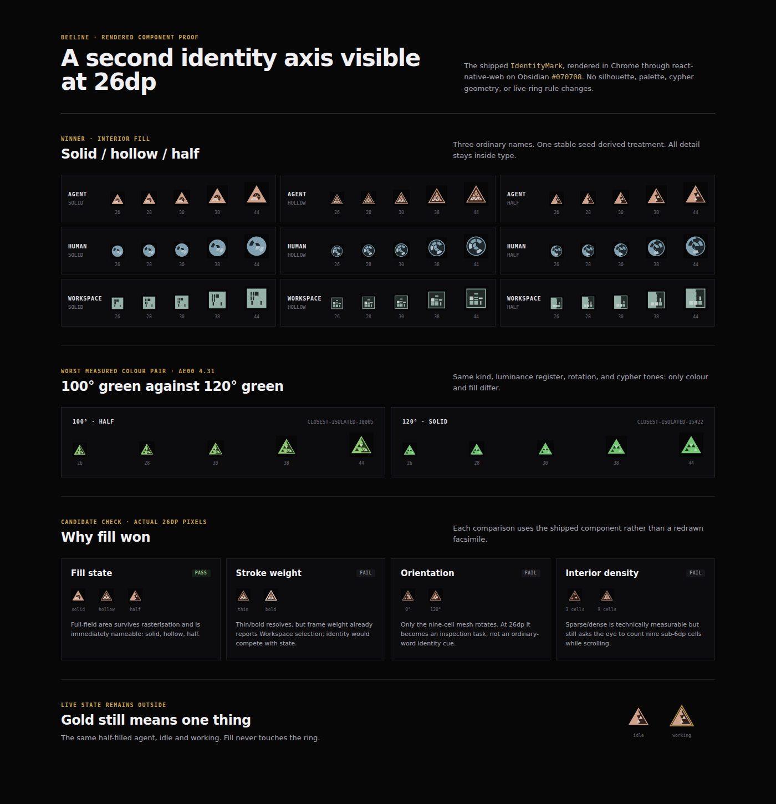

# Identity fill-axis proof

The second nameable identity axis is the mark's interior fill: **solid**,
**hollow**, or **half-filled**. It is derived from a separate deterministic
stream of the identity seed, so it is stable across Workspaces and independent
of signature colour and the nine-cell cypher.



## Render method

The proof page imports the shipped
`apps/mobile/sources/components/buzz/IdentityMark.tsx` and renders it through
`react-native-web` plus `react-native-svg`'s web entry. Only the component's two
external hooks are adapted: the Obsidian theme and `HullLivePulse`. Run:

```sh
npm run identity-mark:proof --prefix apps/mobile
```

Then open `http://127.0.0.1:4173`. The page renders all three kinds and all
three fill states at 26, 28, 30, 38, and 44 CSS pixels. Chrome measured every
SVG exactly equal to its requested holder (including 26×26), with no console
errors. The screenshot was captured at a 1400×1450 viewport on Obsidian
`#070708`.

The same-colour 26×26 agent samples have normalized mean raster luminance of
0.195 (solid), 0.149 (hollow), and 0.165 (half). More importantly, the half
sample's left/right halves measure 0.207 / 0.122, while solid measures 0.203 /
0.186 and hollow 0.151 / 0.148. The split is therefore present in the rendered
pixels as a coarse field, not inferred from SVG source or subpixel detail.

The closest-colour row uses agent seeds `closest-isolated-10005` and
`closest-isolated-15422`. They land on the measured 100° / 120° pair at the
same middle luminance register (`#91c775` / `#75c775`), with the same cypher
rotation and tone sequence. The new fill is therefore the only non-colour cue
between them.

## Candidate result

| Candidate                  | 26dp rendered result                                                                     | Decision                         |
| -------------------------- | ---------------------------------------------------------------------------------------- | -------------------------------- |
| Solid / hollow / half fill | Uses the full interior field; each state remains visible and has an ordinary spoken name | Chosen                           |
| Thin / bold stroke         | Visible, but frame weight already reports Workspace selection                            | Rejected: conflicts with state   |
| Cypher orientation         | Changes only the nine-cell detail and requires inspection to describe                    | Rejected: not pre-verbal         |
| Interior density           | Sparse/dense is measurable, but requires counting sub-6dp cells                          | Rejected: too fine at list speed |

The half fill has one fixed left/right orientation for every kind. It does not
rotate a square into a diamond, deform any silhouette, change the signature
palette, or touch the external gold live ring.

## Roster simulation

The unit test runs 2,000 deterministic same-kind rosters at each size and
reports the probability of at least one collision. A collision here means a
nameable signature collision, not a full nine-cell cypher collision.

| Identities | Hue alone | Hue × fill |
| ---------: | --------: | ---------: |
|          4 |     38.0% |      14.1% |
|          8 |     91.5% |      51.9% |
|         17 |    100.0% |      98.1% |
|         50 |    100.0% |     100.0% |

The 50-identity result is intentionally explicit: sixteen hues times three
fill states provide 48 nameable combinations, so 50 identities cannot all be
nameably unique. The test also proves the system does not silently collapse at
that point: the deterministic 50-member fixture occupies 31 hue × fill pairs
and retains 50 distinct full marks once the unchanged cypher is included.
