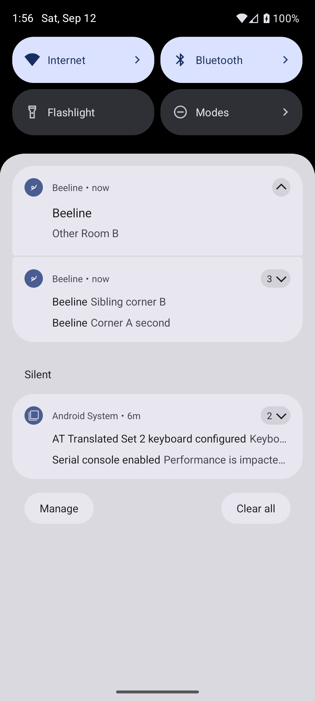

# Native Android grouping development proof — 2026-09-12

This is development proof, not release acceptance. **Final proof is the captain's phone after release.** The runtime-21 `buzzy_api36` / `emulator-5554` rig was not used. A fresh API 36 Google APIs x86_64 emulator (`emulator-5560`) ran this branch's runtime-24 debug binary.

A temporary entry-point harness imported the actual foreground policy, presented-notification dismissal, and `RoomMessageCell`. Its buttons selected fixture Room/corner ids and called the production dismissal helper; it registered its own FCM token. Real notification+data messages were sent through production Firebase credentials to that emulator token only. No captain-device pushes or production message rows were created. The harness and temporary entry point were removed from the shipping tree.

## Demonstrated

| Action | Observed Android presented notifications |
| --- | --- |
| Background: send two corner A pushes, one sibling corner B push (same parent Room A), one Room B push | Four distinct children under two Room summaries (six native records) |
| View parent Room A | Only Room B's child and summary remain (two records) |
| Start again; view corner A | Sibling corner B and Room B survive with their summaries (four records) |
| Send a real FCM push for the open corner A | Handler returns `shouldPresent: false`, reason `open-room-match`; still four records |
| Clear remaining Rooms; send one corner A push, then view corner A | Zero records, including no orphan summary |



The divider screenshots use fixture transcript rows rendered by the production cell. They establish appearance and placement only. The hook test establishes fresh server cursor capture, persistence during one visit, clearing on refocus, and server refresh after a live arrival. The database integration test establishes the actual cursor boundary for Room and corner, including two messages within the same second. This is not an authenticated end-to-end transcript demonstration. No iOS device was available; the existing server fixtures pin APNs `threadId` (iOS `threadIdentifier`) to the parent Room.

[Divider and empty summary](screenshots/push-hygiene/empty-summary-divider-fixture.png) · [Reopened fixture without divider](screenshots/push-hygiene/reopened-divider-fixture.png)

## Commands used

All commands were run in the disposable task worktree. AVD and proof files lived under its ignored `.scratch/push-hygiene/` directory. SDK executables below were under `/home/lunchbox/android-sdk/`.

```sh
ANDROID_AVD_HOME="$PWD/.scratch/push-hygiene/avd" avdmanager create avd \
  --name beeline_push_hygiene --package 'system-images;android-36;google_apis;x86_64' --device pixel_6
ANDROID_AVD_HOME="$PWD/.scratch/push-hygiene/avd" emulator \
  -avd beeline_push_hygiene -port 5560 -no-window -no-audio -no-snapshot -gpu swiftshader_indirect
# apps/mobile:
npx expo prebuild --platform android --no-install
# apps/mobile/android:
ANDROID_HOME=/home/lunchbox/android-sdk ./gradlew :app:assembleDebug \
  -PreactNativeArchitectures=x86_64 --no-daemon --max-workers=4
# worktree root:
adb -s emulator-5560 install -r apps/mobile/android/app/build/outputs/apk/debug/app-debug.apk
adb -s emulator-5560 shell pm grant app.usebeeline android.permission.POST_NOTIFICATIONS
adb -s emulator-5560 reverse tcp:8086 tcp:8086
adb -s emulator-5560 reverse tcp:8766 tcp:8766
# apps/mobile, with the temporary harness entry point:
CI=1 npx expo start --dev-client --port 8086 --localhost
adb -s emulator-5560 shell am start -a android.intent.action.VIEW \
  -d 'exp+buzzy://expo-development-client/?url=http%3A%2F%2F127.0.0.1%3A8086' app.usebeeline
# worktree root; local scripts capture the token without printing it:
python3 .scratch/push-hygiene/proof-receiver.py
python3 .scratch/push-hygiene/send-proof.py groups
python3 .scratch/push-hygiene/send-proof.py foreground
python3 .scratch/push-hygiene/send-proof.py single
adb -s emulator-5560 shell dumpsys notification --noredact
adb -s emulator-5560 exec-out screencap -p
adb -s emulator-5560 emu kill
```

The local sender invoked `flyctl ssh console -a beeline-server -C 'node -e …'`, initialized `firebase-admin` using the deployed `firebaseAppOptions(process.env)`, and called `getMessaging().send` for each fixture. Secrets and the target token are omitted from this record. Each fixture used:

```json
{
  "notification": {"title": "Beeline", "body": "Corner A first"},
  "data": {
    "type": "channel-activity", "target": "message", "workspaceId": "workspace-proof",
    "roomId": "room-a", "channelId": "corner-a", "cornerId": "corner-a",
    "threadId": "room-a", "messageId": "proof-groups-0"
  },
  "android": {"notification": {"tag": "room-a"}},
  "apns": {"payload": {"aps": {"threadId": "room-a"}}}
}
```

This native change is stacked on the runtime-23 OTA-safe work. Android grouping requires a runtime-24 binary and must wait for the native release; it must not hold the runtime-23 OTA. The server cursor, JS dismissal/suppression, and unread divider belong to the base PR.
